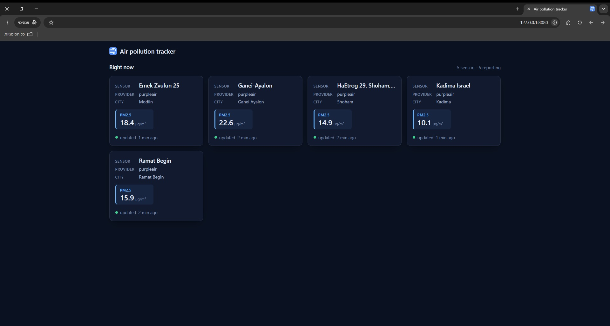
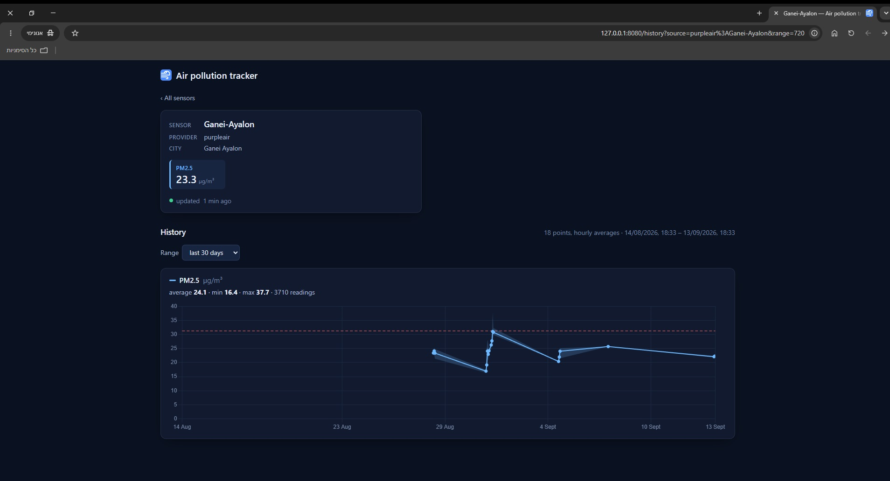
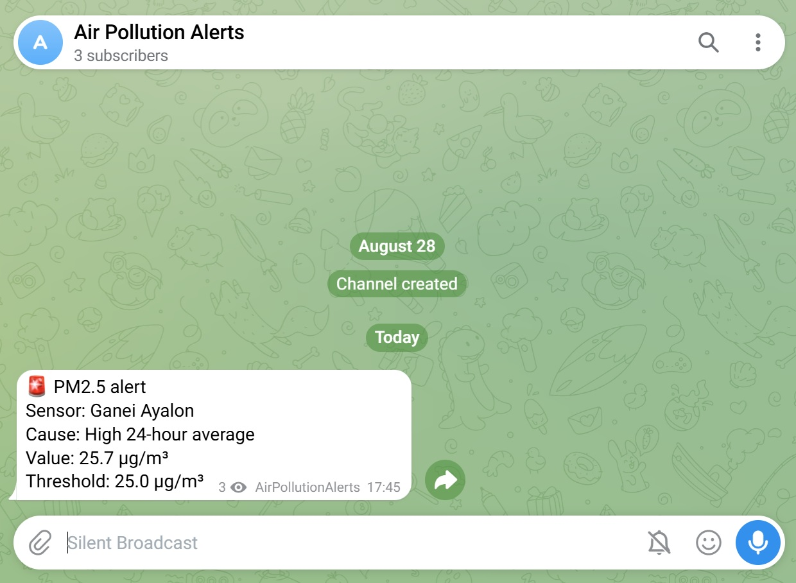
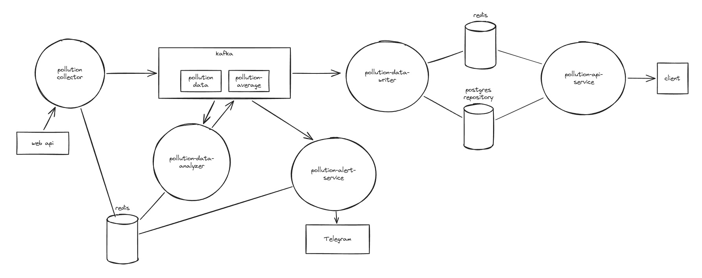

<p>
  <picture>
    <source media="(prefers-color-scheme: dark)" srcset="pollution-api-service/src/main/resources/static/logo.svg">
    
  </picture>
</p>

[](https://github.com/Yiftach128/breezi/actions/workflows/ci.yml)


Breezi is a microservices-based air quality monitoring platform, featuring: a live dashboard of every sensor's current readings (real PurpleAir sensors), historical view of sensors data, and a Telegram alert push (when thresholds are crossed).

It is built as **five Java microservices** around **Kafka**, **Redis** and **PostgreSQL**: every reading streams through Kafka, rolling averages are kept per sensor, alerts go out with cooldowns, the history goes to PostgreSQL. Every service ships as its own container image and runs unchanged on Kubernetes, and the logs of all of them are collected into **Grafana** through Loki.

**Overview — one card per sensor with its current readings**

<p align="center">
  
</p>

**History — a sensor's historical data, shown against the threshold line**

<p align="center">
  
</p>

**Telegram — a PM2.5 alert as posted to the channel**

<p align="left">
  
</p>

## Features

- **Dashboard**
  - Live overview per sensor with its current readings, refreshed every minute.
  - Historical data — one chart per pollutant with the average against a threshold line, over presets from 24 hours to a year or a custom day range. The data is averaged in buckets sized to the range. The view is kept in the URL, so it can be shared.

- **Telegram alerts** — an abnormal reading or a rolling average above its threshold is posted to a Telegram alerts channel (naming the city, pollutant and cause). Every alert series has a cooldown, so the channel is not flooded by alert messages.

- **Rolling averages** — 24-hour, 1-hour and 10-minute averages per sensor and pollutant, published as they change.

- **Pub/sub messaging** — Kafka carries messages between services via publisher/subscriber interfaces, and retains what a restarted consumer missed.
  - No service knows it talks to Kafka (also true for Redis or PostgreSQL). Business code sees only interfaces, so a backend can be swapped, or faked in a test.

- **Scaling and Kubernetes compatibility** — a service is one image, scaled out where its state allows. A Helm chart deploys the five services and the three stores into one namespace, with health probes, resource limits and the scaling rule each service needs.
  - Leaderless coordination: pollution data collectors register in Redis by heartbeat and share the sensors among whoever is registered, so starting or stopping one redistributes the sensors on its own.

- **Logs in Grafana** — every service logs JSON lines, collected into Loki and shown in a provisioned dashboard: errors per service and live logs, filtered by service and level.


## How it works

<p align="center">
  
</p>

**One reading's journey.** The collector polls a PurpleAir sensor and publishes the reading to the Kafka topic `pollution-data`. The analyzer folds it into rolling averages and publishes them to Kafka `pollution-average`. The alert service checks the readings and rolling averages and posts alerts to Telegram if needed. The writer stores the readings used by the API service.

### Microservices

1. **pollution-data-collector** polls the PurpleAir API and publishes each reading to the Kafka topic `pollution-data`. Running instances share the sensors between them (see Redis).
2. **pollution-data-analyzer** keeps rolling averages (24-h, 1-h, 10-min) per sensor and pollutant, persisted in Redis, and publishes them to `pollution-average`.
3. **pollution-alert-service** checks readings and averages against pre-defined health-risk thresholds, with per-series cooldowns in Redis, and posts alerts to a Telegram channel.
4. **pollution-data-writer** stores every reading in PostgreSQL (history) and in Redis (each sensor's current reading, for fast lookups).
5. **pollution-api-service** serves the dashboard from Redis (current readings) and PostgreSQL (history and aggregates).

Kafka carries every message between services. Redis carries every piece of live state. PostgreSQL holds the history.

| Service | Consumes | Produces | Redis                    | PostgreSQL | Replicas |
|---|---|---|--------------------------|---|---|
| `pollution-data-collector` | PurpleAir API | `pollution-data` | group membership         | – | any number, self-sharding |
| `pollution-data-analyzer` | `pollution-data` | `pollution-average` | rolling-average state    | – | 1, stateful by design |
| `pollution-alert-service` | both topics | Telegram | alert cooldowns          | – | 1, atomic cooldowns |
| `pollution-data-writer` | both topics | – | current readings (write) | history (write) | one per partition |
| `pollution-api-service` | – | HTTP `/api/*` | current readings (read)  | history, aggregates (read) | any number |

- **Scaling follows state.** The collector is any number of replicas, self-sharding through Redis; the writer and the API service scale by partition; the analyzer and the alert service run as one instance each as a design choice.
- **Failures stay put.** A service being down never blocks another, and Kafka retains what a restarted consumer missed.

## Storage

### Kafka

| Topic | Message | Producer | Consumers |
|---|---|---|---|
| `pollution-data` | `PollutionData`: city, source, pollutant, value, timestamp | collector | analyzer, alert service, writer |
| `pollution-average` | `PollutionAverage`: one average per window | analyzer | alert service, writer |

- Messages are keyed by source, so one sensor's readings stay on one partition in timestamp order.
- **One consumer group per service**, so every service sees every message.

### Redis

| Key | Owner | TTL | While the key exists              |
|---|---|---|-----------------------------------|
| `collector:member:<id>` | collector | 30 s lease, renewed every 10 s | the instance is in the group      |
| `analyzer:rolling-average-state:<source>:<pollutant>` | analyzer | 24 h after the last save | the series is live and restorable |
| `alert:last-sent:<source>:<pollutant>:<window>` | alert service | that series' cooldown | the series is cooling down        |
| `latest-reading:<source>:<pollutant>` | writer writes, API service reads | 60 min | the sensor is currently reporting |

**Collector group membership:** every instance renews its lease by heartbeat, lists the members, ranks them by id and takes the sensors of its rank. No leader: the sensors are redistributed within a heartbeat (when an instance goes offline or online).

### PostgreSQL

Readings are kept long-term through `IPollutionRepository`, implemented with Hibernate ORM in `persistence-postgres`, the one module that knows the table layout.

- **Idempotent writes.** A unique constraint on `(source, pollutant, measured_at)` makes Kafka redeliveries free; sequence ids let inserts batch.
- **Aggregates computed by the database.** Per-pollutant summaries and bucketed averages (for charts).
- **Schema managed by Hibernate** at startup; the table is created on first use.

## Testing

- **One service at a time.** A test builds a service the way its `Wiring` would, with hand-written fakes for Kafka, Redis, PostgreSQL, PurpleAir and Telegram.
- **No sleeps.** Anything time-based takes a `Clock` or a scheduler the test drives by hand, so a 24-hour window is tested in milliseconds.
- **Fakes next to their contracts.** Each fake ships as a test-jar of the module that owns the interface, so every service tests against the same fake.

## Tech stack

**Services**
- Java 17, Maven multi-module build
- Kafka clients 3.9
- Jedis 5 (Redis)
- Hibernate ORM 6.6 + HikariCP (PostgreSQL)
- Jackson, one shared configuration for Kafka and persistence
- The JDK's own `HttpServer` for the dashboard and the health endpoints — no web framework
- Logback + logstash encoder for JSON logs
- JUnit 5 with hand-written fakes, no mocking library

**Dashboard**
- Vanilla JS modules + CSS, no build step
- Chart.js, vendored

**Infrastructure**
- Docker, one Dockerfile for all five images
- GitHub Actions: tests on every push, images to GitHub Container Registry on `main`
- Helm chart, running on k3s
- Loki + Grafana Alloy + Grafana

## Project layout

```
pollution-common/          entities, IPublisher/ISubscriber (+ Kafka), JsonSupport, thresholds, health server, logging
persistence-common/        IPollutionCache, IPollutionRepository, ILatestReadingStore (no driver)
persistence-redis/         RedisPollutionCache (jedis)
persistence-postgres/      PostgresPollutionRepository (Hibernate ORM, HikariCP)
pollution-data-collector/  entities · api · registry · fetchers · persistence · membership
pollution-data-analyzer/   entities · analysis · persistence
pollution-alert-service/   entities · detection · persistence · senders/telegram
pollution-data-writer/     one service class over IPollutionRepository and ILatestReadingStore (no layers)
pollution-api-service/     entities · queries · web/jdk · static/
helm/                      Helm chart: the five services, Kafka, Redis and PostgreSQL
observability/             Loki + Alloy + Grafana
public/                    screenshots and the architecture diagram
Dockerfile                 one build for all five images
.env.example               every setting, with its default
.github/workflows/ci.yml   tests on every push, images on main
```

**Loose coupling.** No service imports a Kafka, Redis or PostgreSQL class: business code sees only `IPublisher<T>`/`ISubscriber<T>`, `IPollutionCache<T>` and `IPollutionRepository`. The concrete classes are named in one place per service, `config/Wiring.java` (assembly only; `config/Config.java` holds the values), so a backend is swapped in one file and every service is unit-tested with hand-written fakes.

## Getting started

### Prerequisites

- **Java 17** or newer and **Maven**
- **Docker**, for Kafka, Redis and PostgreSQL
- A **PurpleAir read key** (from purpleair.com)
- Optional: a **Telegram bot** and a channel it can post to, for real alerts

### Install

```sh
git clone https://github.com/Yiftach128/breezi.git
cd breezi
mvn -DskipTests package    # or `mvn verify` to run the tests first
```

### Configure

Copy `.env.example` to `.env` and fill it in. `.env.example` documents every setting with its default; only the API key is required. A variable set in the process environment wins over `.env`. The main ones:

| Variable | Service | Default | What it does |
|---|---|---|---|
| `PURPLEAIR_API_KEYS` | collector | *required* | PurpleAir read keys, comma-separated |
| `PURPLEAIR_SENSORS` | collector | two sensors | The sensors to poll, `<sensor_index>=<city>`, comma-separated |
| `POSTGRES_PASSWORD` | writer, API service | empty | The database password (`pollution` with the Docker command below) |
| `TELEGRAM_BOT_TOKEN`, `TELEGRAM_CHAT_ID` | alert service | empty: alerts are only logged | The bot and the channel it posts to |
| `KAFKA_HOST`, `REDIS_HOST`, `POSTGRES_HOST` | all | `localhost` | Where the stores are |
| `API_PORT` | API service | `8080` | The dashboard's port |

### Run

Start the stores:

```sh
docker run -d --name kafka -p 9092:9092 apache/kafka:3.9.1
docker run -d --name redis -p 6379:6379 redis:8
docker run -d --name postgres -p 5432:5432 \
  -e POSTGRES_USER=pollution -e POSTGRES_PASSWORD=pollution -e POSTGRES_DB=pollution postgres:17
```

Then one terminal per service, from any directory:

```sh
java -jar pollution-data-collector/target/pollution-data-collector.jar
java -jar pollution-data-analyzer/target/pollution-data-analyzer.jar
java -jar pollution-alert-service/target/pollution-alert-service.jar
java -jar pollution-data-writer/target/pollution-data-writer.jar
java -jar pollution-api-service/target/pollution-api-service.jar
```

Then open **http://127.0.0.1:8080/**. Topics and the table are created on first use.

- A second collector is just another `java -jar` of the same jar. Give it its own `-Dapp.name` so its log file does not collide with the first one's.
- Logs go to the console and to `logs/<service>.json`, which the observability stack tails (see below).
- An image: `docker build --build-arg SERVICE=<service> -t <service> .`

## Deploy on Kubernetes

`helm/breezi` deploys the whole system into one namespace as plain Kubernetes YAML: a `Deployment` per service and per store — Kafka (one KRaft broker), Redis and PostgreSQL. Developed on a single-node k3s.

```sh
cp helm/breezi/values-secrets.example.yaml helm/breezi/values-secrets.yaml   # fill in
helm upgrade --install air-pollution helm/breezi -n air-pollution --create-namespace \
  -f helm/breezi/values-secrets.yaml
kubectl -n air-pollution get pods -w
```

- **Data survives.** Kafka and PostgreSQL keep their data on volumes that survive `helm uninstall`; Redis needs none: every key has a TTL.
- **Configuration.** A `ConfigMap` hands every pod the stores' addresses and the health port, a `Secret` the password and API keys from a git-ignored values file. A checksum annotation rolls the pods when only the configuration changed.
- **Probes.** Every pod answers liveness on `/healthz` and readiness on `/readyz`, on a port of its own. Ready means started (state restored, subscribed), not that the stores are reachable, so a store outage does not cascade into every pod being marked unready.
- **Dashboard.** The API service is the one `Service` reachable from outside: `LoadBalancer` on port 8080 by default, so on k3s <http://localhost:8080/>; `NodePort` is the alternative (`apiService.service.type`).
- **Deploy a commit.** CI pushes every service's image to GHCR tagged `sha-<short commit>`; `--set image.tag=sha-<short commit>` changes the pod templates and rolls them out. With `latest` nothing changes on upgrade, so use `kubectl rollout restart` instead.
- **Scale.** `kubectl -n air-pollution scale deployment/pollution-data-collector --replicas=3` reshares the sensors within a heartbeat; the writer and the API service scale through `writer.replicas` and `apiService.replicas`; the analyzer and the alert service have no replica value and run as one instance with `Recreate`.
- **Logs.** `kubectl -n air-pollution logs deployment/<service> -f`.

## Observability

`observability/` is a Docker Compose stack of **Loki**, **Grafana Alloy** and **Grafana**, provisioned with a "Pollution Services — Logs" dashboard: errors per service and live logs, filtered by `service` and `level`.

```sh
docker compose -f observability/docker-compose.yml up -d    # then Grafana at http://localhost:3000/
```
